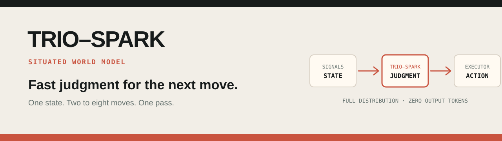
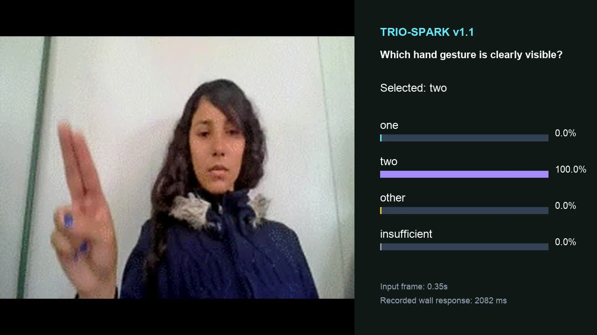
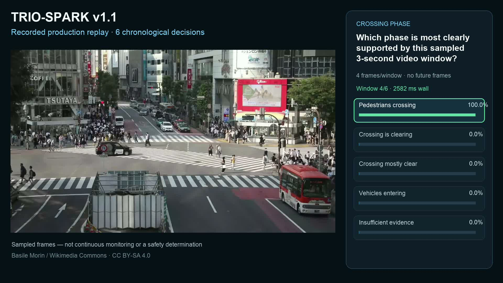
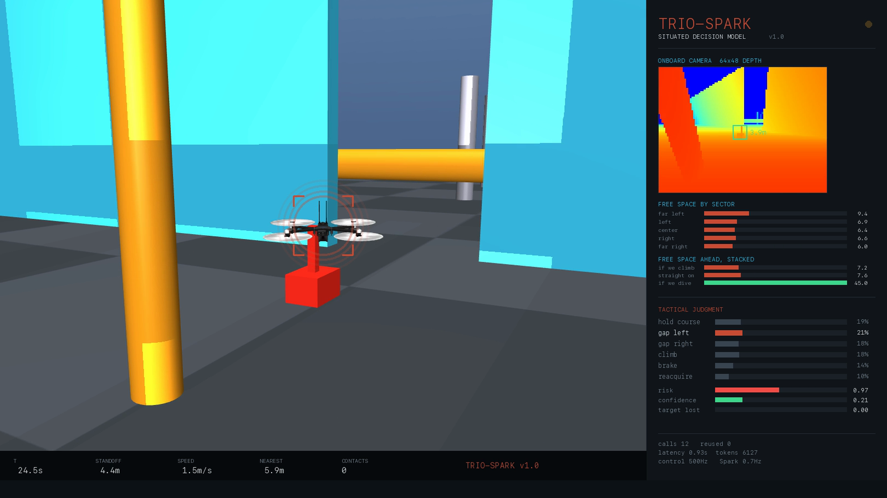
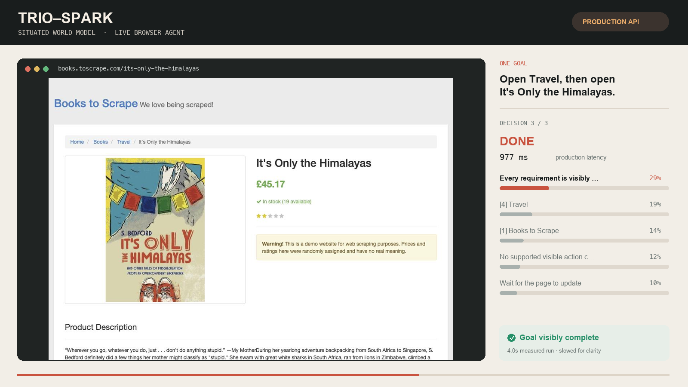
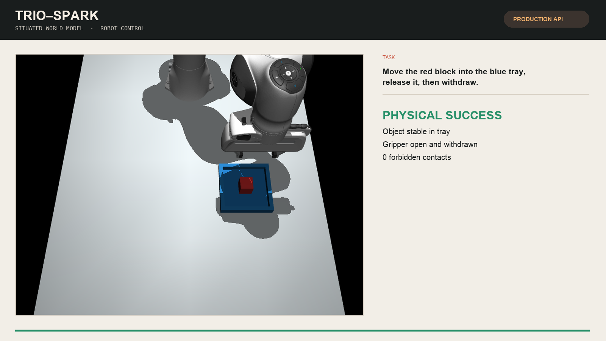

<p align="center">
  
</p>

<p align="center">
  <a href="https://platform.machinefi.com/spark"><strong>Try Trio-Spark</strong></a>
  ·
  <a href="docs/api.md">API Docs</a>
  ·
  <a href="https://platform.machinefi.com/spark#billing">Pricing</a>
  ·
  <a href="https://machinefi.com/blog/trio-spark-decisions-single-pass">Launch Post</a>
</p>

Trio-Spark is a **Situated World Model** built for fast judgment. Give it the state of an environment and 2–8 possible moves. In one pass, it returns the best next move and a probability for every choice.

Trio-Spark is currently available as a hosted API. Model weights and training code are not publicly released. This repository is its public home for API clients, integrations, evaluations, and community-built demos.

## Visual decisions in v1.1

Use `trio-spark-v1.1` for text, a single image, or a short sequence of 2–4 video
frames. Tell Spark what matters in the scene and define the answers your
application can act on. The same key and wallet cover both text and vision at
**$0.042 per million billed input tokens**.

[Visual API quickstart](docs/visual.md) · [Try hand gestures](https://platform.machinefi.com/spark?demo=gestures) · [Console Docs](https://platform.machinefi.com/spark/docs)

## Visual demos · v1.1

### Read a hand signal

[](assets/demos/Trio-Spark-v1.1-Visual-Gestures.mp4)

Watch moving hand footage alongside four recorded visual decisions and their
probabilities. Dataset captions were removed before inference.

**22 seconds · four real model calls**

[Run the demo](demos/visual-gestures/) · [Recording details](demos/visual-gestures/evidence.json) · [Watch MP4](assets/demos/Trio-Spark-v1.1-Visual-Gestures.mp4)

### Watch a crossing change

[](assets/demos/Trio-Spark-v1.1-Crossing-Phase.mp4)

Six chronological video windows show a pedestrian wave followed by vehicles and
pedestrians moving through the crossing together. The display updates from
recorded model responses and preserves the measured request timing.

**30 seconds · six real model calls · four frames per window**

[Run the demo](demos/crossing-phase/) · [Recording details](demos/crossing-phase/evidence.json) · [Watch MP4](assets/demos/Trio-Spark-v1.1-Crossing-Phase.mp4)

These v1.1 videos replay real calls to our deployed visual inference service.
The recording details identify the serving path, inputs and timings.
Their runnable examples use the public API.
Source footage credits and licenses are included with each demo.

## Text-driven demos · v1.0

The following v1.0 videos replay real production API runs with presentation overlays.
Their decisions use structured text state.

### Autonomous drone

[](assets/demos/Trio-Spark-v1.0-Drone.mp4)

Spark chose tactical maneuvers while a simulated quadrotor followed a moving rover through an obstacle field. A separate 500 Hz reflex controller retained collision avoidance.

**65 s · 25 model calls · 75.7 m flown · 0 collisions · course completed**

[Run this demo](demos/drone/) · [Measured evidence](demos/drone/evidence.json) · [Watch MP4](assets/demos/Trio-Spark-v1.0-Drone.mp4)

### Browser agent

[](assets/demos/Trio-Spark-v1.0-Browser-Agent.mp4)

Spark read the visible page state, opened the requested category, selected the requested book, and stopped when the goal was visibly complete.

**4.002 s · 3 model calls · 2 browser actions · autonomous `DONE`**

[Run this demo](demos/browser-agent/) · [Measured evidence](demos/browser-agent/evidence.json) · [Watch MP4](assets/demos/Trio-Spark-v1.0-Browser-Agent.mp4)

### Robot arm

[](assets/demos/Trio-Spark-v1.0-Robot-Arm.mp4)

Spark repeatedly chose the next manipulation skill from fresh MuJoCo state: approach, grasp, lift, carry, lower, release, and withdraw. The simulator evaluated physical success independently.

**13.68 s · 13 model calls · physical success · 0 forbidden contacts**

[Run this demo](demos/robot-arm/) · [Measured evidence](demos/robot-arm/evidence.json) · [Watch MP4](assets/demos/Trio-Spark-v1.0-Robot-Arm.mp4)

### More recorded production runs

These compact runs show the same decision API in games, operations, and a GUI
safety workflow:

- [Falling Blocks](demos/falling-blocks/) — 16 decisions, 7 lines cleared
- [2048](demos/2048/) — 26 decisions, 19 scoring turns
- [Restaurant Rush](demos/restaurant-rush/) — 6 changing operating situations
- [GUI Agent Safety](demos/gui-safety/) — policy gate plus bounded human handoff

Each directory includes a sanitized decision record and measured evidence. The
videos replay captured production responses with presentation timing.

## Build with Trio-Spark

Create an API key in the [Trio-Spark console](https://platform.machinefi.com/spark#api-keys), then follow the [public API reference](docs/api.md).

```bash
export TRIO_SPARK_API_KEY=tf_...

python - <<'PY'
from clients.python.trio_spark import decide

result = decide(
    task="Keep the machine safe while completing the current operation.",
    state={"temperature_c": 84, "load_pct": 91, "vibration": "rising"},
    choices={
        "continue": "Continue at the current speed",
        "slow": "Reduce speed and keep observing",
        "stop": "Stop the machine now",
    },
    session_id="machine-line:shift-42",
)

print(result["choice_id"])
print(result["probabilities"])
PY
```

The dependency-free Python client lives at [`clients/python/trio_spark.py`](clients/python/trio_spark.py). The request/response schema, limits, errors, and pricing are documented in the [public API reference](docs/api.md). Account management and live usage remain in the [Trio-Spark console](https://platform.machinefi.com/spark).

## Reproduce the public benchmarks

The [`evals/`](evals/) harness runs the hosted production API against pinned
public dataset revisions and records accuracy, calibration, latency, billed
tokens, cost, model version, and raw responses. Start with a small smoke before
spending credits on a complete split:

```bash
python3 -m pip install -r evals/requirements.txt
python3 evals/run.py --benchmark sst2 --limit 10 --output runs/sst2-smoke
```

See [`evals/README.md`](evals/README.md) for the reproducibility contract and
the exact commands used for full runs.

The product and release name is **Trio-Spark v1.0**. The current API model
identifier remains `trio-spark-preview` for compatibility.

## How Spark fits into an agent

```text
environment signals → structured state → Trio-Spark → next move → executor
                              ↑                         │
                              └──── fresh feedback ─────┘
```

Spark makes a bounded decision. Your application defines the state, allowed moves, executor, and safety controls. The same API can therefore support software agents, games, robots, industrial systems, and other environments where the next move matters.

## Contribute a demo

We welcome demos that use Trio-Spark in new environments. A useful contribution should make the model's role easy to understand and the run easy to verify.

1. Build the demo against the hosted Trio-Spark API.
2. Add it under `demos/<demo-name>/` with setup and reproduction instructions.
3. Include a compact evidence file with the task, number of API calls, measured latency, outcome, and relevant environment checks.
4. Include a short MP4 and a 16:9 poster under `assets/demos/` when the result is visual.
5. State clearly which signals were sent to Spark and which controls remained deterministic.
6. Open a pull request using the demo template.

Do not commit API keys, account data, raw credentials, or private endpoints. A successful demo should be a recorded real run rather than a scripted animation presented as model output.

See [`CONTRIBUTING.md`](CONTRIBUTING.md) for the complete checklist.

## Repository structure

```text
clients/          minimal API clients
demos/            reproducible integrations and measured evidence
assets/demos/     shareable videos, posters, and checksums
```

The current demos use structured signals derived from their environments: depth-derived flight telemetry, visible browser DOM state, and simulator geometry plus contacts. They do not claim direct end-to-end control from raw camera pixels.

## License

MachineFi-authored code is licensed under Apache-2.0. The demo adapters target MIT-licensed upstream projects. See [`THIRD_PARTY.md`](THIRD_PARTY.md) for exact repositories and revisions.
